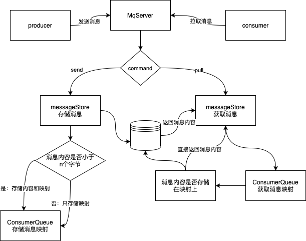

## HeShenMQ
[](https://www.java.com)
[](https://github.com/netty/netty)
[](https://github.com/MortyCode/HsMq)
[](https://github.com/MortyCode/HsMq)
```
 _   _   _____       ___  ___   _____    
| | | | /  ___/     /   |/   | /  _  \   
| |_| | | |___     / /|   /| | | | | |   
|  _  | \___  \   / / |__/ | | | | | |   
| | | |  ___| |  / /       | | | |_| |_  
|_| |_| /_____/ /_/        |_| \_______|  
```
### 功能简述
1. 基于Netty来实现的消息中间件

### 功能简述
 

---
### 开发日志：
6.09 实现了消息的发送以及接受，开始开发消息存储

6.12 开始实现持久化,通过NIO操作文件存储
