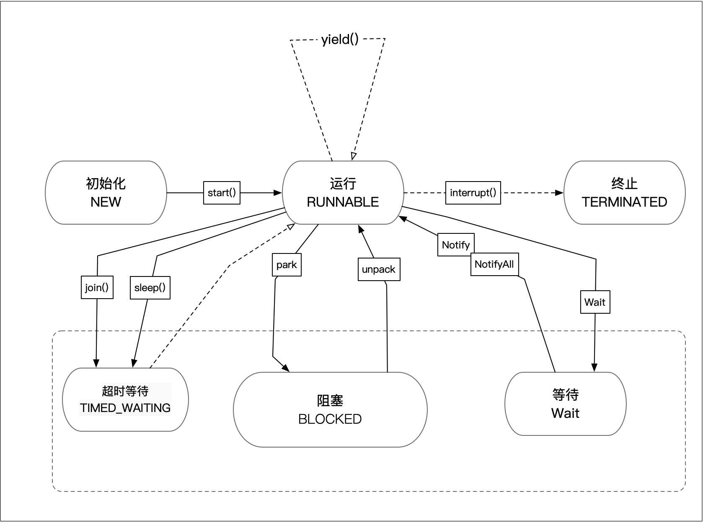

## 线程生命周期

## 线程的方法
| **方法名** | **方法解释** | **其他** |
| --- | --- | --- |
| Thread.yield() | 让当前运行线程回到可运行状态，允许具有相同优先级的其他线程获得运行机会。但是不一定是别的线程执行，有可能执行yield()方法的线程也可能被调度。 | yield()不会导致线程转到等待/睡眠/阻塞状态。 |
| join() | 阻塞调用此方法的线程, 进入 TIMED_WAITING 状态，直到线程t完成，此线程再继续；
例如主线程调用自线程的join方法，则主线程的在join之后的内容会在自线程执行完成之后执行 | 底层就是调用wait方法。当join的参数是0的时候，会不停的调用wait方法，即只要子线程是活的，主线程就不停的等待 |
| sleep() | 使当前线程（即调用该方法的线程）暂停执行一段时间，让其他线程有机会继续执行,但它并不释放对象锁。也就是说如果有synchronized同步快，其他线程仍然不能访问共享数据。
 | sleep()可以使低优先级的线程得到执行的机会，当然也可以让同优先级、高优先级的线程有执行的机会。
可以在任何地方调用 |
| **wait()** | 使此对象监视器当前执行的线程处于“等待(阻塞)状态”，“直到其他线程调用此对象的 notify() 方法或 notifyAll() 方法”，当前线程被唤醒(进入“就绪状态”)。 | 
1. 会释放同步锁
1. 需要在同步代码块调用
 |
| **wait(long timeout)** | 使此对象监视器当前执行的线程处于“等待(阻塞)状态”，“直到其他线程调用此对象的 notify() 方法或 notifyAll() 方法，或者超过指定的时间量”，当前线程被唤醒(进入“就绪状态”)。 | 
1. 会释放同步锁
1. 需要在同步代码块调用
 |
| notify() | 唤醒在此对象监视器上等待的单个线程。 | 从对象的等待池中移走一个任意的线程并放到锁标志等待池中，只有锁标志等待池中线程能够获取锁标志；如果锁标志等待池中没有线程，则notify()不起作用 |
| notifyAll() | 唤醒在此对象监视器上等待的所有线程。 | 从对象等待池中移走所有等待那个对象的线程并放到锁标志等待池中。 |

